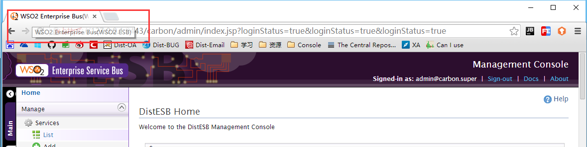
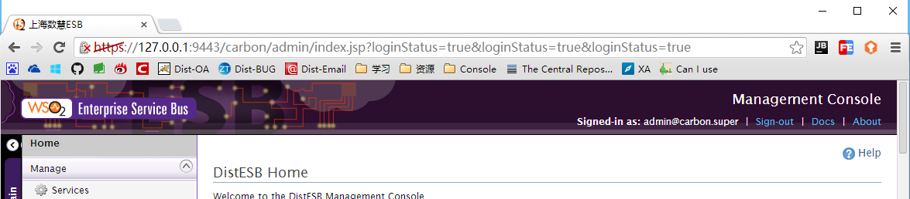
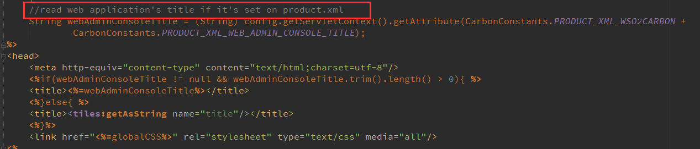

WSO2 具体某个产品的页面标题是根据产品类型来定的，以 ESB 为例，产品标题是：**WSO2 Enterprise Bus(WSO2 ESB)**，如下截图所示：



可以按照如下两种方式来修改此标题：
- [修改jsp页面代码](#修改jsp页面代码)
- [修改源码，重新编译](#修改源码)

### 修改jsp页面代码
定位到如下文件：
> carbon-kernel-version\core\org.wso2.carbon.ui\src\main\resources\web\admin\layout\template.jsp

打开此文件，定位到如下内容(84行)：
```
<%if(webAdminConsoleTitle != null && webAdminConsoleTitle.trim().length() > 0){ %>
<title><%=webAdminConsoleTitle%></title>
<%}else{ %>
<title><tiles:getAsString name="title"/></title>
<%}%>
```
注释掉上面的代码，添加下面的内容：
```
<title>上海数慧ESB</title>
```
重启启动后，页面标题就变成了自定义的标题，如下：



### 修改源码
从上面的 template.jsp 页面源码中可以知道，页面的标题值来自于product.xml这个文件，如下所示：



注意红框中的提示信息，这个文件在如下的源码目录中：
>product-esb\modules\styles\service\src\main\resources\META-INF\product.xml

打开此文件，内容如下：
```
...
<product xmlns="http://products.wso2.org/carbon">
    <properties>
       <property name="userforum">http://wso2.org/forum/187</property>
       <property name="userguide">http://docs.wso2.org/display/ESB481/WSO2+Enterprise+Service+Bus+Documentation</property>
       <property name="mailinglist">http://wso2.org/mail</property>
       <property name="issuetracker">https://wso2.org/jira/browse/STRATOS</property>
       <property name="webAdminConsoleTitle">WSO2 Enterprise Service Bus</property>
       <property name="collapsedmenus">region1_configure_menu,region3_registry_menu,region4_monitor_menu,region5_tools_menu</property>
    </properties>
</product>
```
上述内容中 **name** 属性为 **webAdminConsoleTitle** 的 property 节点值就是定义的页面标题，修改为实际要设置的值即可，如下：
```
...
<product xmlns="http://products.wso2.org/carbon">
    <properties>
       <property name="userforum">http://wso2.org/forum/187</property>
       <property name="userguide">http://docs.wso2.org/display/ESB481/WSO2+Enterprise+Service+Bus+Documentation</property>
       <property name="mailinglist">http://wso2.org/mail</property>
       <property name="issuetracker">https://wso2.org/jira/browse/STRATOS</property>
       <property name="webAdminConsoleTitle">上海数慧ESB</property>
       <property name="collapsedmenus">region1_configure_menu,region3_registry_menu,region4_monitor_menu,region5_tools_menu</property>
    </properties>
</product>
```
修改完成后，重新打包整个 **product-esb** 工程，启动后即可看到设置的页面标题。

> product.xml 文件所在的模块打包会生成一个 **org.wso2.esb.styles_version.jar**，此jar包会发布到 wso2esb-version\repository\components\plugins 目录。但是打包后的 jar 包里面并没有此 product.xml 文件，目前还不清楚整个 product-esb 项目打包的过程中把 product.xml 文件给抽取到何处去了。