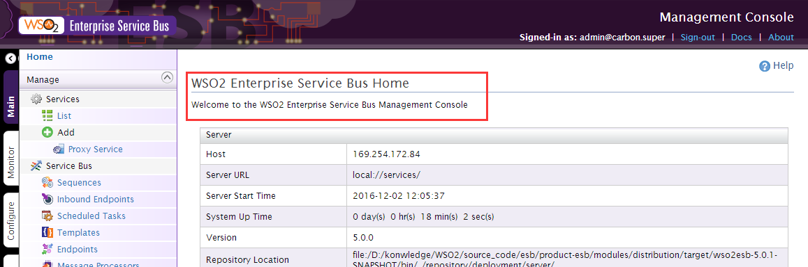
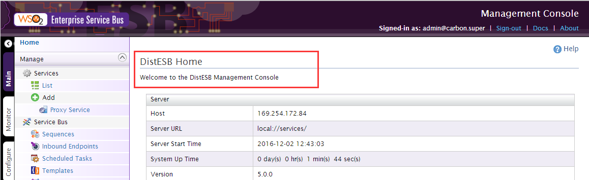

当登录WSO2 ESB之后，默认的页面会显示如下的产品名称：



这部分的信息定义在如下文件中（关于此文件的更多信息，参考[Carbon 平台页面汉化](./carbon.md)）：

> esb-home/repository/components/plugins/org.wso2.carbon.i18n_4.4.9.jar/org/wso2/carbon/i18n/Resources.properties

打开文件，定位到如下内容(88行)：
```
...
### index page ###
carbon.server.home={0} Home
carbon.console.welcome=Welcome to the {0} Management Console
...
```
这两行的内容就是上图中红色部分的内容，可以看到各自有一个**占位符{0}**，这个占位符的内容来自于如下文件：
> esb-home/repository/conf/carbon.xml

打开文件，定位到如下内容(29行)：
```
...
<Server xmlns="http://wso2.org/projects/carbon/carbon.xml">

    <!--
       Product Name
    -->
    <Name>WSO2 Enterprise Service Bus</Name>

    <!--
       machine readable unique key to identify each product
    -->
    <ServerKey>ESB</ServerKey>
...
```
修改上诉配置的Name节点值即可，比如我改成**DistESB**，之后界面就变成如下：



此部分的源码在：
> carbon-kernel-version\core\org.wso2.carbon.ui\src\main\resources\web\admin\index.jsp

打开文件，定位到如下内容(47行):
```
...
<%
    String serverName = CarbonUIUtil
                        .getServerConfigurationProperty("Name");
%>
<h2>
    <fmt:message key="carbon.server.home">
        <fmt:param value="<%= serverName%>"/>
    </fmt:message>
</h2>

<p>
    <fmt:message key="carbon.console.welcome">
        <fmt:param value="<%= serverName%>"/>
    </fmt:message>
</p>
...
```
从源码中可以看到**占位符不能去掉**。
