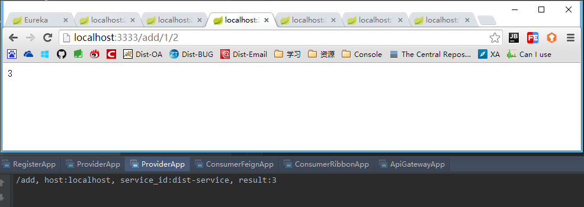

### 注册中心
用来注册所有的服务，当部署注册中心集群时，自身也可以注册到其它的注册中心中。使用注册中心的好处在于它维护了一份服务地址列表，而且使得服务之间并不需要记住彼此的真实地址。

注册中心的配置如下：
```
server.port=1111
eureka.client.register-with-eureka=false
eureka.client.fetch-registry=false
eureka.client.serviceUrl.defaultZone=http://localhost:${server.port}/eureka/
```
注册中心启动后，访问:[http://localhost:1111/](http://localhost:1111/)，如下：

 

现在我注册了服务提供者(DIST-SERVICE，2个实例)，消费者(DIST-FEIGN-CONSUMER 和 DIST-RIBBON-CONSUMER)及网关(API-GATEWAY)。界面如下：

 

 

### 服务提供者
在注册中心可以看到 DIST-SERVICE ，这个就是服务的提供者，在启动时注册到注册中心，配置如下:
```
spring.application.name=dist-service
server.port=2223
eureka.client.serviceUrl.defaultZone=http://localhost:1111/eureka/
```

> **dist-service** 就是此实例在注册中心的名字，这个名字会被所有注册到注册中心的服务所识别。

现在启动了两个一模一样的实例。端口分别为 2222 和 2223，访问地址为：[http://localhost:2222/add?x=1&y=2](http://localhost:2222/add?x=1&y=2) 和 [http://localhost:2223/add?x=1&y=2](http://localhost:2223/add?x=1&y=2)直接调用服务提供者如下：

 

 
 
### 服务消费者
Demo中有两个消费者，取任意一个使用就可以了。同样，消费者启动后，自动注册到注册中心。因为后面要演示网关，所以就搞了两个不同方式实现的消费者，分别用 feign 和 ribbon 实现了一遍(可以在代码里面去看实现的差异，特别是调用服务提供者的差异，推荐用 feign)。上面直接调用的服务，这样没法在多个实例上去做负载均衡。除非前端去处理，但是这样一来，前端就得知道所有的提供者地址，在微服务架构里面，提供者的地址对前端来说应该是透明的。所以我们需要消费者去完成这样的事，由消费者决定调用哪个服务提供者。

各自的配置如下：
```
spring.application.name=dist-feign-consumer
server.port=3334
eureka.client.serviceUrl.defaultZone=http://localhost:1111/eureka/
```
```
spring.application.name=dist-ribbon-consumer
server.port=3333
eureka.client.serviceUrl.defaultZone=http://localhost:1111/eureka/
```

示例：连续调用ribbon消费者([http://localhost:3333/add/3/4](http://localhost:3333/add/3/4))两次 ，当启动负载均衡后，消费者会分别调用两个服务提供者各一次。

 

 

Feign([http://localhost:3334/add/4/5](http://localhost:3334/add/4/5))同理。

### 网关
发布的服务，肯定不是谁都能用，大多数场景都是身份验证通过后才能使用。不管是在提供者还是在消费者层面上，增加相应的验证机制都会随着服务的增多而变得越来越困难，而且如果验证机制有变，所有的服务程序都要做出相应的调整，这显然不合理。所以在所有的服务之前，需要有一个网关来完成这件事，过滤、验证等都交给这个网关，由网关来统一管理。除此之外，网关还能充当路由的功能，由它决定把服务发到哪，与ESB的区别在于它不管消息的格式，也不会对响应进行改造。
示例配置：
```
spring.application.name=api-gateway
server.port=1100

zuul.routes.a.path=/a/**
zuul.routes.a.serviceId=dist-ribbon-consumer
zuul.routes.b.path=/b/**
zuul.routes.b.serviceId=dist-feign-consumer

eureka.client.serviceUrl.defaultZone=http://localhost:1111/eureka/
```
之前我们启动了两个消费者，根据这个配置，我们可以把不同的请求发到不同的消费者：当请求上下文是a时，发到dist-ribbon-consumer；当请求上下文是b时，发到dist-feign-consumer。

> 注意：在整个架构中，服务的真实地址都是透明的，使用服务注册后的名称来完成各组件之间的交流。

[http://localhost:1100/a/add/1/2?accessToken=123](http://localhost:1100/a/add/1/2?accessToken=123)

 

[http://localhost:1100/b/add/1/2?accessToken=123](http://localhost:1100/b/add/1/2?accessToken=123)

   

上面的两个请求，通过网关处理后，实际上发到了不同的消费者，具体消费者调用哪个服务提供者实例，就看消费者的负载均衡策略了。细心的话可以看到后面的参数都加上了**accessToken**，这是模拟的一个验证:如果请求时没有相应的token，网关就直接忽略此次请求，否则才允许此次请求。可以看到不管服务再怎么增多，机制再怎么变化，我们只需要对网关做出相应的调整，而不需要对大量的服务实体去做调整。

示例：通过网关请求时不带token

    

相关参考地址：
- [Spring Boot](http://projects.spring.io/spring-boot/)
- [Spring Cloud](http://projects.spring.io/spring-cloud/)
- [Spring Cloud Netflix](http://cloud.spring.io/spring-cloud-netflix/)
- [文章](http://blog.didispace.com/springcloud1/)